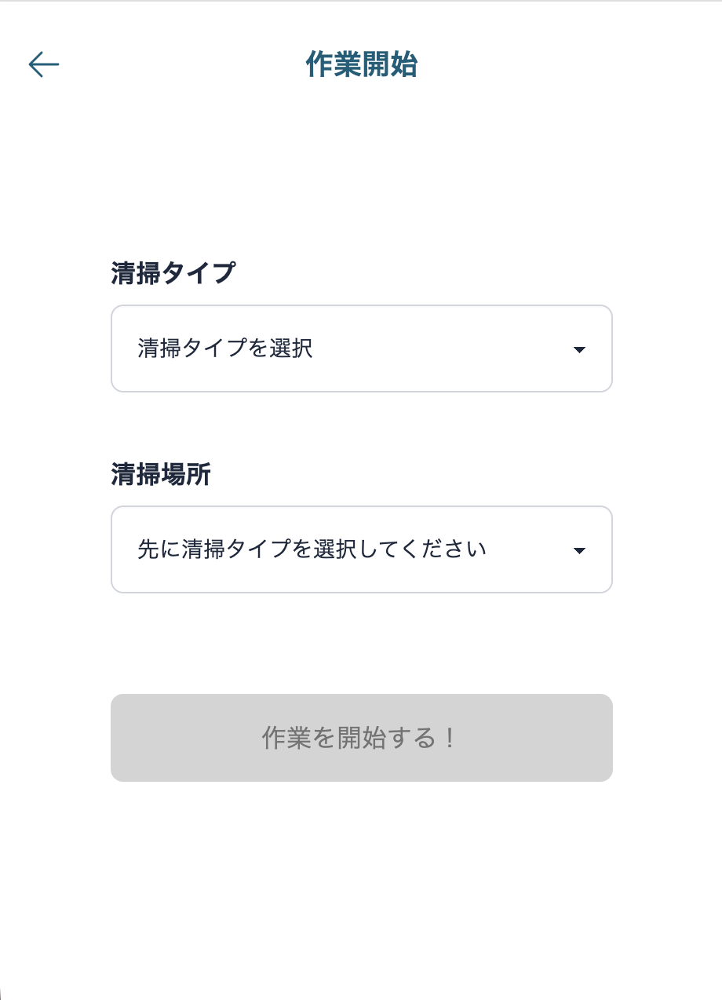
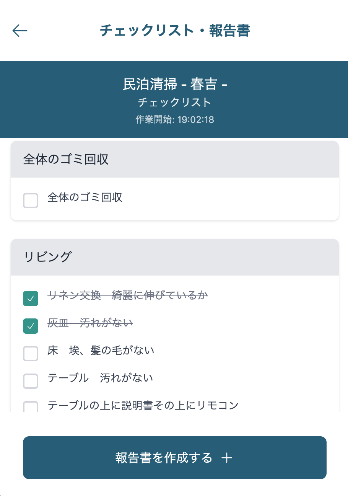
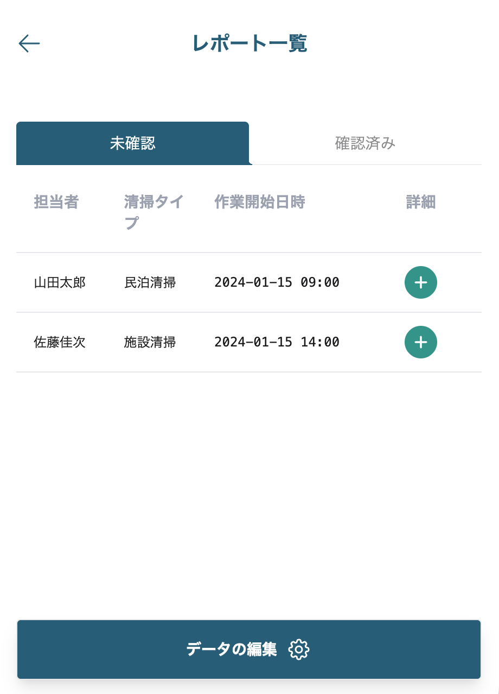
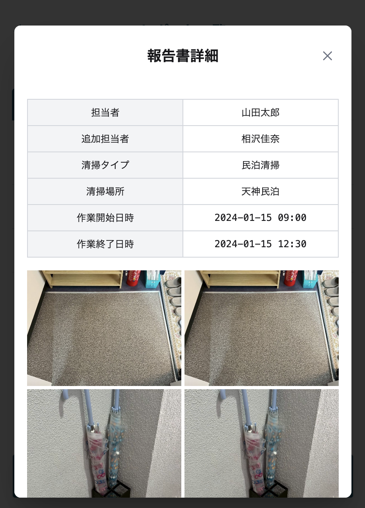

# 清掃管理システム

業務用の清掃作業を効率化する管理システムです。
作業報告の入力、チェックリスト管理、レポート確認機能を提供します。

## 🌐 デモ

**本番環境:** https://cleaning-management-app.netlify.app

### 📸 画面イメージ

#### 作業開始


清掃タイプと清掃場所を選択して作業を開始。

#### チェックリスト


清掃箇所ごとの詳細なチェック項目を管理。リアルタイムで作業状況を記録。

#### レポート一覧


作業履歴を一覧表示。未確認・確認済みをタブで切り替え可能。

#### レポート詳細


作業内容の詳細確認と、確認済みステータスの変更が可能。写真付きで作業記録を保存。

## ✨ 主な機能

- **作業報告の入力・管理** - 清掃作業の開始・終了時刻、担当者、場所を記録
- **チェックリスト機能** - 清掃箇所ごとの詳細なチェック項目を管理
- **レポート確認** - 作業履歴の一覧表示・検索
- **データ編集** - 清掃タイプ、エリア、チェックリスト項目の追加・編集・削除

## 🛠️ 技術スタック

### フロントエンド
- **React 18** - UIライブラリ
- **TypeScript** - 型安全な開発
- **TailwindCSS** - スタイリング
- **Vite** - ビルドツール

### バックエンド・インフラ
- **Supabase** - BaaS（PostgreSQL、認証、API）
- **Netlify** - ホスティング・CI/CD

### 開発ツール
- **Git/GitHub** - バージョン管理
- **Vitest** - テストフレームワーク
- **ESLint** - コード品質管理

## 📁 プロジェクト構成
```
cleaning-management-system/
├── frontend/          # フロントエンドアプリケーション
│   ├── src/
│   │   ├── components/   # Reactコンポーネント
│   │   ├── pages/        # ページコンポーネント
│   │   ├── services/     # API通信層
│   │   └── configs/      # 設定ファイル
│   └── public/
└── backend/           # バックエンド（レガシー・参考用）
```

## 💻 ローカルでの起動方法

### 前提条件
- Node.js 18以上
- npm または yarn

### セットアップ手順

1. リポジトリをクローン
```bash
git clone https://github.com/haruka-2431/cleaning-management-system.git
cd cleaning-management-system/frontend
```

2. 依存パッケージをインストール
```bash
npm install
```

3. 環境変数を設定
```bash
# .env.local ファイルを作成
cp .env.example .env.local
```

`.env.local` に以下を設定：
```
VITE_SUPABASE_URL=your_supabase_url
VITE_SUPABASE_ANON_KEY=your_supabase_anon_key
```

4. 開発サーバーを起動
```bash
npm run dev
```

→ http://localhost:8080 でアクセス可能

### ビルド
```bash
npm run build
```

## 🚀 開発の背景

プログラミングスクールの卒業制作としてチーム開発で制作。
卒業後、個人でデータベースをMySQL → Supabase（PostgreSQL）に移行し、本番環境へデプロイしました。

### 技術的な工夫

- TypeScriptによる型安全な実装
- コンポーネント設計による再利用性の向上
- Supabaseを活用したサーバーレス構成
- テスト駆動開発による品質管理

## 📝 今後の改善予定

- [ ] ユーザー認証機能の実装
- [ ] 画像アップロード機能の追加
- [ ] レスポンシブデザインの最適化
- [ ] パフォーマンス改善

## 👤 開発者

**磯部晴香**
- GitHub: [@haruka-2431](https://github.com/haruka-2431)

---

**開発期間:** 2025年3月～7月（チーム開発）、7月～（個人での改善・運用）
